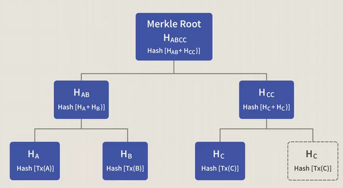

# Solution
To mine a block and get the maximum amout of sats i have to build to build the block header that consist in;
- Version (at the moment, not specified, so i'll use 00000001)
- Merkle root see [Making Merkle Root](#Making_The_Merkle_Root)
- Timestamp I will use 1710997192
- Difficulty target that is 0000ffff00000000000000000000000000000000000000000000000000000000, meaning 4 zeroes.
- and the nonce, see [Finding the nonce](#Finding_The_Nonce)

I decided to make static data so that is easy to verify the nonce and the block without re-mining it. but you can re-mine the block changing the timestamp just adding the -remine flag to the binary.

## Making The Merkle Root

The Merkle Root is basically a tree structure that hashes the tx ids until you got only one for validating the transactions composition... in this way, changing one tx id will change all the Merkle Root.

but the Merkle root can only have valid tx ids and you have to verify the weight of the block when adding transactions, the weight being 4 mbs.

To achieve this in a performant way i have to sift through transactions in a logical order to avoid unnecessary work. Being:

1.  Verifying the transaction Syntax
2.  Input Signature
3.  Locking Script Validation
4.  UTXO Validation + spent value check + locktime (in case of conflict)

after that, I should have a list of valid transactions and before building the Merkle Root itself I have to find the highest fee transaction composition that can fit in 4mb block data.

after think for a while, i came with the right solution to this problem, the knapsack problem.

>Given a set of items, each with a weight and a value, determine which items to include in the collection so that the total weight is less than or equal to a given limit and the total value is as large as possible.
[Knapsack problem at Wikipedia](https://en.wikipedia.org/wiki/Knapsack_problem)

### Implementing the Knapsack Algorithm

For this algorithm, i have to extract some information of the transactions.

After this point consider every transaction mentioned a valid one. From these transactions i have to extract their size in megabytes, their total fee of transactions and their tx id.

But in this way, I could still got some errors because I may spend a transaction that I did not include previously in the block and to avoid that I need to previously make a list of connected transactions and consider it as an object to be included in the block, this object will expose the total size in megabytes and the fee of all transactions included in the list.

*fazer um esquema pra reprentar as listas de transacoes*

After that, we have to implement the 0-1 Knapsack algorithm to search for the best combination of the transaction list objects.

The knapsack algorithm actually make a table that combines all the alternatives but with a computing economic approach.I really suggest to read or watch about.

### Finally Building the Merkle Root

After this, we have the exactly transactions that we will include in our block and now we can make the Merkle Root by hashing 1 or 2 txids and hashing the results together until we have a unique hash at the end.

## Finding The Nonce

At the [beginning of the document](#solution) i mentioned some data that consist in the block header:
- Version (at the moment, not specified, so i'll use 00000001)
- Merkle root see [Making Merkle Root](#Making_The_Merkle_Root)
- Timestamp I will use 1710997192 or some function to get the timestamp at the minig process
- Difficulty target that is 0000ffff00000000000000000000000000000000000000000000000000000000, meaning 4 zeroes.

and the nonce that i will explain the process of obtaining now.

To mine a block i need to discover the block hash that the difficulty wants, in the case is `000ffff00000000000000000000000000000000000000000000000000000000`
which means that my block needs 4(four) 0(zeroes) at the beginning, e.g. `0000(the rest of the hash)`.

Between the data that is hashed and the hash itself there is some random number called nonce
> A nonce is an arbitrary number used only once in a cryptographic communication, in the spirit of a nonce word. 
At: https://en.wikipedia.org/wiki/Cryptographic_nonce

In the Bitcoin context is a 4-byte(or 32-bit) integer value(e.g. any number between `0` and `4,294,967,296` but in the code will be represented with the hexadecimal notation, that is `0x00000000` and `0xffffffff`)that we will include and generate until the hash function output make the hash that we want(any hash that has 0000 at the beginning).

The "mining" process consist in finding the right nonce that will get us the hash that we need to find.

There is a chance that the 32-bit nonce will not have enough entropy to find the hash, but if this occurs, the timestamp will change.

To find that, we have a certain number of hashes that we can get with 32-bit nounce that is `4,294,967,296` hashes, wen the nounce came to its maximum, the algorithm will change the timestamp so we can try the nounce all again, keeping this process until we have the hash.

When the algorithm finds the hash it will log all the output into some `{blockhash}log.txt` file. This will help anyone to test the program.

## Development Process
- [X] Something

### Efficiency and optimization  
First i will prototype in python and later re-write everything in rust... i think that this is the best way to write good code, without bugs and test covered.